# Online Gallery

This online social art gallery utilizes the Met Art Collection API as a source
to search for artwork that users can favorite and add to their personal gallery. Users' galleries are viewable by searching their username in the user database.

https://online-gallery2.herokuapp.com/

## home page:
- seader that has search, social, log in and sign up / settings and log out
- search bar to search API for works of art by name
- some links to sections that better organize artwork, basically just search buttons.

## social page:
- a search for users by username

## profile:
- display favorited artworks
- edit your page somehow

## API:
The Met API does not require users to register or obtain an API key, but asks that requests are limited to 80 per second.

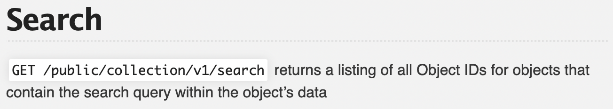
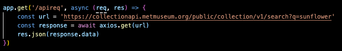
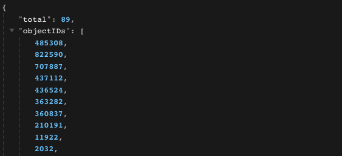

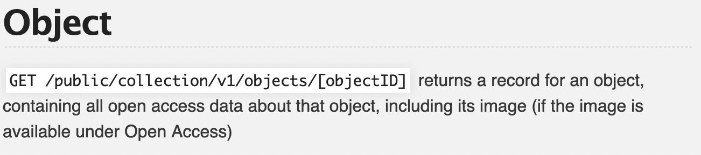
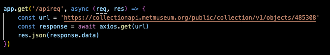
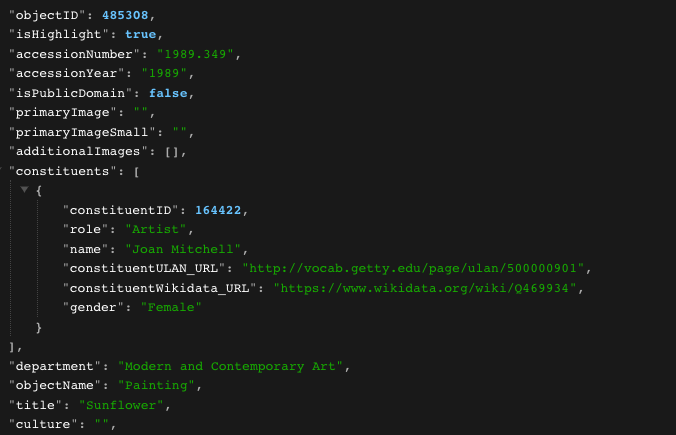

## MVP:
- User page and user creation
- Art search that displays pictures of art, description, time, and artist
- Comment functionality added to each show page of art

## Stretch Goals:
- Create a user page that users can edit the display of
- More user page options, changing the colors or drawing on anything.
- feeling lucky button

## Index:
User sign in/up or logged in
Recent comments in recent discussions, maybe it automatically updates and displays the five latest comments?

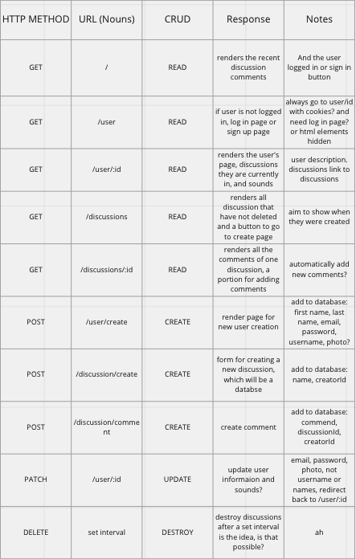

Databases:
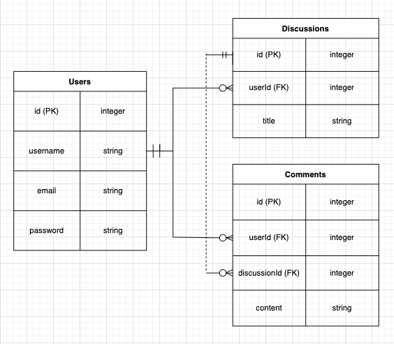

## Some Pages
Index:
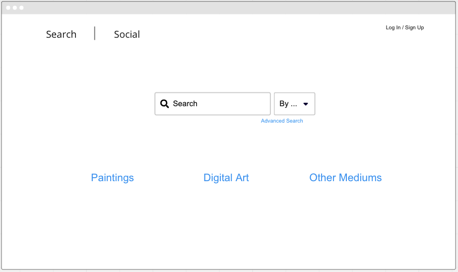
Search Query
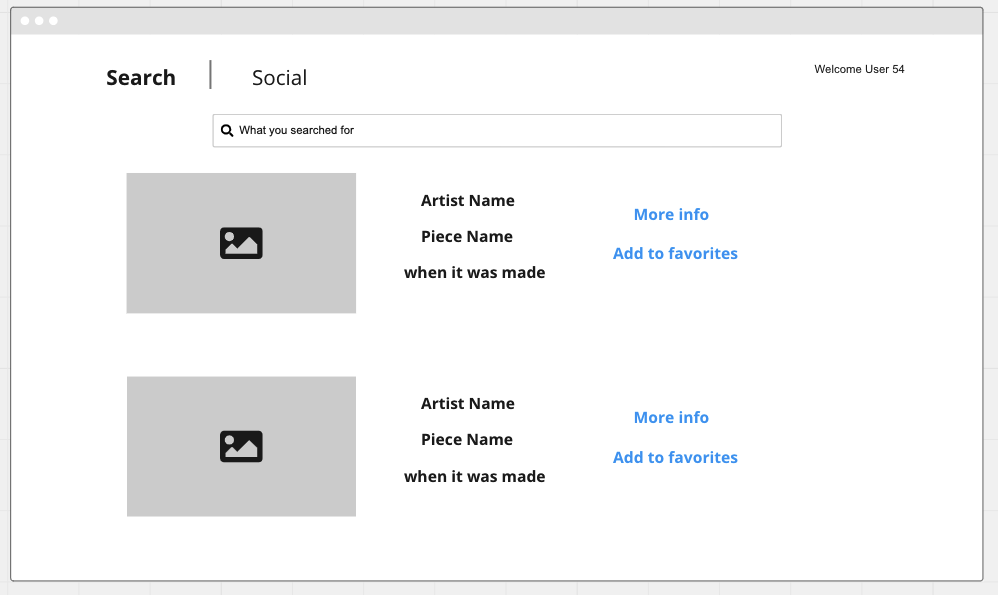
Search Show
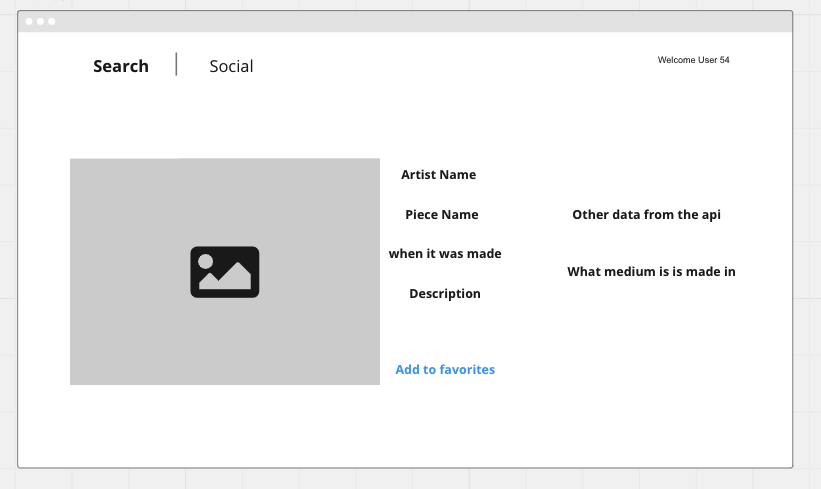
User page (self view)
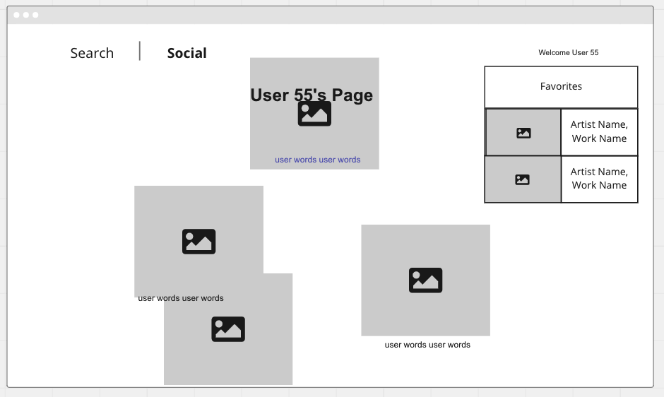
User page (other view)
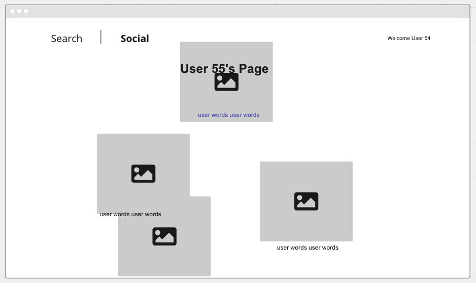

## User stories:
- I want to be able to for artwork
- I want to have artwork suggested by type 
- I want to be able to put my favorited artworks on my user page
- I want to be able to edit the layout of my user page
- I want to be able to search for other users
