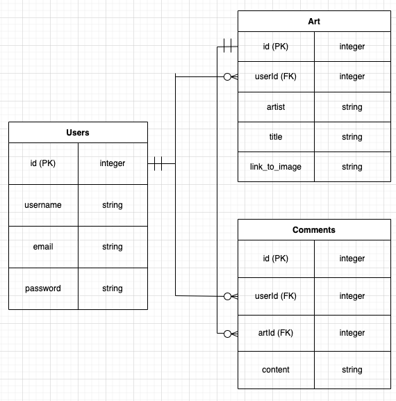

# Online Gallery

Search engine for Harvard Art Museum's Api to display art or allow users to favorite art, leave comments on pieces' pages, and decorate a page with their favorite art.

Users can create homepages that have display favorited artwork in a layout they create. They can write brief descriptions of the artworks they show.

## Home page:
- Header that has home, user pages (that links to user page if logged in) log in and sign up / settings and log out
- Search bar to search API for works of art (with description and artist) by name, artist name, time period, 
- some links to sections that better organize artwork, basically just search buttons.

## User page:
- a search for users by username
- display favorited artworks
- edit your page somehow

## API:
The Harvard Art Musuem has an api.

## MVP:
- User page and user creation
- Art search that displays pictures of art, description, time, and artist
- Comment functionality added to each show page of art
- Create a user page that users can edit the display of

## Stretch Goals:
- More user page options, changing the colors or drawing on anything.

## Index:
User sign in/up or logged in
Recent comments in recent discussions, maybe it automatically updates and displays the five latest comments?

FORGOT DELETE USER OPTION

Databases:

## Some Pages
Index:

Search Query

Search Show

User page (self view)

User page (other view)

## User stories:
- I want to be able to for artwork
- I want to have artwork suggested by type 
- I want to be able to put my favorited artworks on my user page
- I want to be able to edit the layout of my user page
- I want to be able to search for other users
